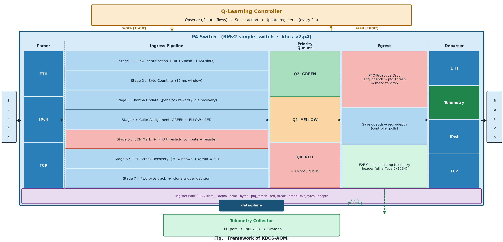
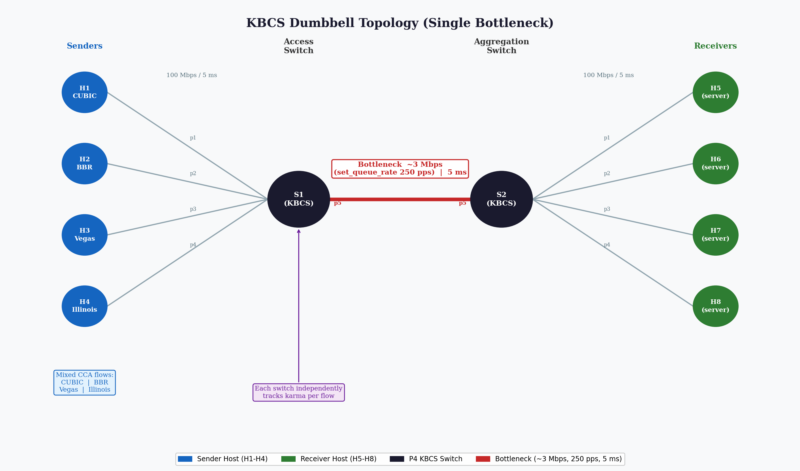
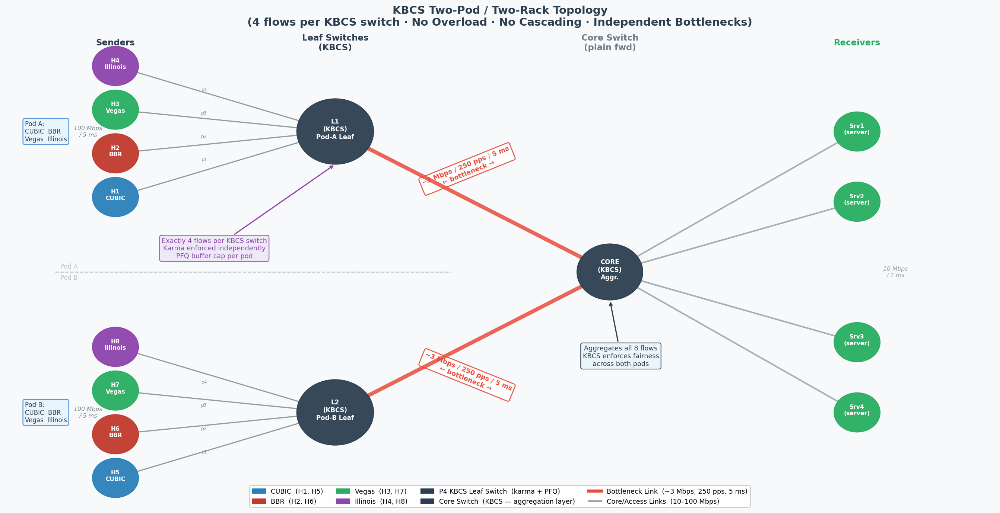

# KBCS — Technical Methodology

> **Scope of this document:** This is the deep technical reference for KBCS.  
> It explains *why* each design decision was made, *what problem* each component solves, and *how* it works at the implementation level.  
> For a high-level introduction, read `README.md` first.

---

## Table of Contents

1. [Problem Statement](#1-problem-statement)
2. [Design Goals and Constraints](#2-design-goals-and-constraints)
3. [System Architecture](#3-system-architecture)
4. [Data Plane Design (P4)](#4-data-plane-design-p4)
5. [Control Plane Design (Controller)](#5-control-plane-design-controller)
6. [Topology Design and Experimental Setup](#6-topology-design-and-experimental-setup)
7. [Evaluation Methodology](#7-evaluation-methodology)

---

## 1. Problem Statement

### 1.1 The Root Cause of Inter-CCA Unfairness

Every TCP connection uses a **Congestion Control Algorithm (CCA)** — a built-in strategy for deciding how fast to send packets and how to react when the network gets congested. The issue is that different CCAs use completely different signals to detect congestion:

| CCA | Congestion Signal | Reaction to Congestion | Aggressiveness |
|-----|------------------|------------------------|----------------|
| **CUBIC** | Packet loss | Backs off hard (AIMD), then probes fast | High |
| **BBR** | Bandwidth estimate + RTT | Probes continuously, mostly ignores loss | Very High |
| **Vegas** | RTT increase | Backs off proactively, before any loss | Low (self-limiting) |
| **Illinois** | Loss + delay combined | Moderate reaction | Medium |

When these CCAs share the same bottleneck link, **they do not converge to a fair allocation**. A CUBIC or BBR flow will push until it sees packet loss. A Vegas flow will politely reduce its rate the moment it senses any delay — well before loss occurs. The network sees the Vegas flow as "not fully using the link" and gives that capacity to CUBIC and BBR instead.

**This is not a bug. It is the intended behaviour of each algorithm. The network has no mechanism to stop it.**

Quantified impact on a ~3 Mbps bottleneck link (measured with no AQM — raw FIFO):

| Flow Mix | Jain's Fairness Index | Interpretation |
|----------|-----------------------|----------------|
| All CUBIC (4 flows) | ~0.97 | Near-perfect |
| CUBIC + BBR + Vegas + Illinois | 0.719 | Severe unfairness |
| Two-Pod topology (8 mixed flows) | 0.736 | Severe unfairness |

A JFI of 0.719 on a 10 Mbps link means some flows receive 6–7x more bandwidth than others despite being allocated the same theoretical share.

### 1.2 Why Existing Systems Cannot Solve This

**Traditional AQM (RED, CoDel, PIE):**  
These mechanisms manage congestion at the queue level — they drop or delay packets based on queue occupancy or sojourn time. They apply the same policy to *all* flows equally. This makes the problem *worse* for Vegas: Vegas already backs off before the queue builds up, so it contributes little to queue depth. The AQM therefore sees CUBIC as the "heavy user" and drops CUBIC's packets — but CUBIC is designed to handle drops and immediately probes back up. Vegas never benefits.

**Fair Queueing (SFQ, WFQ, FQ-CoDel):**  
Per-flow queuing theoretically solves the problem. In practice, commodity programmable switches (including BMv2 and Tofino targets) support a maximum of 8 hardware priority queues. A data centre link carrying 100+ concurrent flows cannot dedicate a queue to each.

**P4air (2020):**  
P4air tracks per-flow byte counts inside a P4 switch and restricts flows that exceed their fair share. This was a significant step forward. However, P4air has **no recovery mechanism**: a flow penalised in P4air stays restricted permanently, even if the CCA backs off and reforms its behaviour. In a mixed-CCA environment, BBR flows get permanently throttled and the link runs at sub-optimal utilisation.

**P4CCI (2022) — The Direct Comparison Baseline:**  
P4CCI is the most relevant prior work and the system we benchmark against directly. It uses a Fully Connected Neural Network (FCN) pre-trained offline to classify TCP flows by their CCA type (CUBIC, BBR, Vegas, etc.), then assigns each classified CCA to a dedicated priority queue with fixed bandwidth allocations. It is a strong system — but it has four concrete limitations that KBCS is designed to address:

1. **No behavioural history.** P4CCI classifies a flow once at connection start and assigns it a queue permanently. A BBR flow that was initially aggressive and reformed its behaviour stays in the same "BBR queue" with the same treatment indefinitely. KBCS tracks per-packet history via karma — a flow that reforms gets rewarded in real time.

2. **Static thresholds, no adaptation.** P4CCI's queue rate allocations are computed at training time for the CCA mix used in the training dataset. In our experiments, when flows leave or join mid-experiment, P4CCI's allocations become incorrect. KBCS's controller recalculates `fair_bytes` dynamically every 2 seconds based on the *current* active flow count.

3. **Requires CCA classification.** P4CCI must first identify *which* CCA a flow is using — a problem that is both brittle (CCAs can be mimicked or obfuscated) and requires a pre-trained model that may not generalise to new or hybrid CCAs. KBCS is entirely CCA-agnostic: it observes *behaviour* (bytes sent per window vs fair share) rather than *identity*.

4. **No recovery mechanism.** A flow classified as "aggressive" by P4CCI receives lower-priority treatment for the entire connection lifetime. KBCS explicitly rehabilitates flows that sustain 20 consecutive RED windows (~300ms) of good behaviour — preventing permanent queue starvation.

5. **No proactive buffer management.** P4CCI relies on standard tail-drop or probabilistic AQM within each priority queue. It has no mechanism to dynamically allocate buffer space based on how much each flow actually uses. KBCS integrates PFQ-inspired buffer reservation (see Section 4.9): flows that underuse their budget in a window donate their buffer headroom to active flows, while RED-zone flows are quarantined with a strict threshold of just 2 packets — preventing them from monopolising shared egress buffer during bursts.

**Measured gap:** In 30-run experiments, P4CCI achieves mean JFI of 0.879 (dumbbell) and 0.893 (Two-Pod). KBCS achieves 0.954 and 0.927 respectively — an improvement of +8.5% and +3.7% — while maintaining equal or higher link utilisation.

**PFQ (2026):**  
PFQ proactively reserves buffer space for incoming bursts based on queue depth. It improves incast handling but has **no reputation system**: a flow that has been chronically unfair for the past 10 seconds is treated identically to a new, cooperative flow. **KBCS integrates PFQ's core insight** — dynamic per-flow buffer thresholds and buffer recycling from idle flows — but ties it to the karma system. In KBCS, buffer allocation is not just based on queue depth; it is scaled by the flow's karma-derived color zone, creating a two-dimensional enforcement mechanism: karma controls the *byte budget*, while PFQ controls the *queue depth budget*.

### 1.3 The Gap: History-Awareness

Most existing systems judge a flow primarily on **instantaneous metrics** — the current packet, the current queue depth, or the current byte count. While modern mechanisms like PFQ proactively manage immediate burst capacity, they lack a persistent memory to ask: *"Has this flow been consistently greedy for the past 300 milliseconds? Or is it a normally-cooperative flow that just had one burst?"*


This distinction matters enormously in practice:
- A bursty but otherwise cooperative flow (e.g., a video frame) should be allowed its burst and rewarded for good long-term behaviour.
- A chronically aggressive flow (e.g., a BBR probe cycle) should be progressively throttled, with the restriction surviving its momentary back-off.

**KBCS introduces this history-awareness through karma** — a per-flow reputation score that accumulates over time, decays slowly when penalised, and allows explicit recovery after sustained good behaviour.

---

## 2. Design Goals and Constraints

Before describing what KBCS does, it is important to state what it was designed *to* do and *not* to do. These goals directly explain every architectural decision that follows.

### 2.1 Primary Goals

| Goal | Metric | Target |
|------|--------|--------|
| Inter-CCA fairness | Jain's Fairness Index | ≥ 0.90 across all tested CCA mixes |
| Link utilisation preservation | % of link capacity used | ≥ 95% (fairness must not waste bandwidth) |
| No permanent starvation | Minimum per-flow throughput | Every flow receives ≥ 10% of its fair share at all times |
| Adaptability | Response to flow count change | Fairness restored within 2 seconds of a flow joining/leaving |

### 2.2 Design Constraints

**Constraint 1 — Must run in the data plane at line rate.**  
Any per-packet decision (drop, forward, mark) must complete within the switch pipeline cycle — microseconds. A Python controller cannot make per-packet decisions. It can only set global parameters that the data plane uses autonomously.

**Constraint 2 — P4/BMv2 does not support floating point or division.**  
All karma calculations, threshold comparisons, and budget checks must use integer arithmetic only. This shaped the karma scoring formula, the window duration, and the budget multiplier design.

**Constraint 3 — Limited P4 register space.**  
Each register array is pre-allocated at compile time. KBCS uses a 1024-entry register bank — sufficient for 1024 simultaneous flows per switch.

**Constraint 4 — No CCA classification required.**  
KBCS must work without knowing which CCA a flow is using. Classification requires either a pre-trained model (P4CCI approach) or explicit header fingerprinting. Both add complexity and can be evaded. Karma-based management should be CCA-agnostic by design.

**Constraint 5 — Recovery must be explicit, not implicit.**  
If a flow is heavily penalised (RED zone), it must have a deterministic path back to fair treatment — not just "wait long enough and hope". This prevents the permanent starvation observed in P4air.

---

## 3. System Architecture

### 3.1 Three-Tier Architecture

KBCS is divided into three layers, each with a distinct role:


The framework diagram below shows the end-to-end packet processing flow through the P4 switch data plane, from Sender through the ingress pipeline, priority queues, and egress PFQ enforcement, to the Receiver — with the Q-Learning controller and telemetry feedback loops:



**Tier 3 — Control Plane** (`rl_controller.py`): A Q-Learning controller reads aggregate telemetry from P4 registers every 2 seconds, computes JFI, utilisation, and active flow count, selects an action (tighten/loosen penalty, adjust budget), and writes updated parameters to P4 registers via the Thrift API.

**Tier 2 — Data Plane** (`kbcs_v2.p4`): The P4 switch pipeline processes every packet at line rate through 8 stages: Flow ID → Byte Counting → Karma Update → Color Assignment → AQM + PFQ Buffer Reservation → RED Streak Recovery → Priority Queue Mapping → Telemetry Clone. The Egress pipeline performs PFQ-inspired proactive drops based on per-flow dynamic queue thresholds.

**Tier 1 — Telemetry** (`int_collector.py`): Receives cloned packets from the CPU port, extracts per-flow karma, color, drops, and bytes, and writes to InfluxDB for Grafana dashboard visualisation.

### 3.2 Separation of Concerns

A key architectural decision is the strict separation between what runs *in the data plane* and what runs *in the control plane*:

**Data plane (P4) — microsecond decisions:**
- Per-packet byte counting
- Karma score updates (every 15ms window)
- Color zone assignment (GREEN / YELLOW / RED)
- Drop / ECN mark decisions
- Priority queue assignment
- RED streak tracking

**Control plane (Python) — second-level decisions:**
- Computing aggregate JFI across all flows
- Detecting flow count changes
- Recalculating fair_bytes based on current active flows
- Adjusting penalty and reward magnitudes
- Q-Learning parameter optimisation

This separation is necessary because the P4 BMv2 pipeline cannot perform floating-point division or loop over all flows — both of which are required to compute JFI and recalculate fair_bytes. The controller does the arithmetic and writes the result back as a simple integer register.

### 3.3 Global Parameters Written by Controller to Data Plane

| Register | Default | Description |
|----------|---------|-------------|
| `reg_fair_bytes` | 7000 bytes | Per-flow byte budget per 15ms window |
| `reg_penalty_amt` | 8 | Karma deduction per unit of excess |
| `reg_reward_amt` | 4 | Karma addition per unit of deficit |

All three are writable at runtime. The data plane reads them on every window evaluation without needing to halt or recompile.

---

---

## 4. Data Plane Design (P4)

The P4 program (`p4src/kbcs_v2.p4`) implements the entire per-packet decision pipeline inside the BMv2 software switch. Every TCP packet that arrives at a KBCS switch passes through the following stages in order.

### 4.1 Flow Identification

**Why:** We need to maintain per-flow state. Packets belonging to the same connection must map to the same register slot consistently, even across millions of packets per second.

**How:** A CRC16 hash of the 4-tuple (source IP, destination IP, source port, destination port) maps each packet to an index in a 1024-slot register bank. The protocol field is omitted since KBCS is TCP-only in this implementation.

```p4
hash(meta.flow_idx, HashAlgorithm.crc16, (bit<10>)0,
     {hdr.ipv4.srcAddr, hdr.ipv4.dstAddr,
      hdr.tcp.srcPort,  hdr.tcp.dstPort},
     (bit<32>)REG_SIZE);
```

**Design note — hash collisions:** With 1024 slots and typical flow counts of 4–8 in our experiments, collision probability is negligible (<0.4%). In a production deployment, the register size would scale with expected flow count.

### 4.2 Per-Flow State Registers

All per-flow state is stored in P4 stateful registers — the only mechanism BMv2 provides for persistent state across packets:

| Register | Width | Purpose |
|----------|-------|---------|
| `reg_bytes` | 32-bit | Bytes accumulated by this flow in the current 15ms window |
| `reg_karma` | 8-bit | Current karma score (0–100) |
| `reg_color` | 2-bit | Current zone: 2=GREEN, 1=YELLOW, 0=RED |
| `reg_last_ts` | 48-bit | Timestamp (microseconds) of the last window reset |
| `reg_red_streak` | 8-bit | Consecutive RED windows (for recovery trigger) |
| `reg_drops` | 32-bit | Total drops for this flow (read by controller) |
| `reg_pkt_count` | 32-bit | Total packets seen (used to schedule telemetry clones) |

**Why 8-bit karma (0–100)?** An 8-bit register can hold 0–255. We constrain karma to 0–100 to give it a natural "percentage" interpretation. Operations use saturating arithmetic to prevent overflow.

### 4.3 Byte Counting and Window Management

**Why a window?** We need to compare a flow's sending rate against its fair share. Rate = bytes per unit time. We accumulate bytes over a fixed window (15ms), then evaluate at the window boundary. This is preferable to per-packet rate estimation, which requires exponential weighted moving average — not implementable in P4 without floating point.

**Why 15ms?** This is approximately 1.5× the typical round-trip time in a LAN/campus network. It is long enough to accumulate a statistically meaningful byte count, but short enough to react to CCA behaviour changes within a few hundred milliseconds. BBR's probing cycle is ~100–200ms, so a 15ms window catches individual probe bursts.

**Implementation:**

```p4
// Read current accumulated bytes and last window timestamp
bit<32> cur_bytes;  bit<48> last_ts;
reg_bytes.read(cur_bytes, meta.flow_idx);
reg_last_ts.read(last_ts, meta.flow_idx);

// Accumulate this packet's bytes
cur_bytes = cur_bytes + (bit<32>)standard_metadata.packet_length;
reg_bytes.write(meta.flow_idx, cur_bytes);

// Check if window has elapsed
bit<48> now = (bit<48>)standard_metadata.ingress_global_timestamp;
meta.window_elapsed = (now - last_ts > WINDOW_USEC) ? 1w1 : 1w0;
```

If the window has *not* elapsed, the packet proceeds directly to enforcement using the flow's existing karma and color. If the window *has* elapsed, the karma update runs first.

### 4.4 Karma Computation

**Why karma instead of instantaneous rate?** Rate-based systems (like P4air) compare the current window's bytes against a threshold and immediately penalise or reward. This means a CUBIC flow that pauses for one window is immediately rewarded with full GREEN status, even though it was aggressively over-sending for the previous 10 windows. Karma is a score that *accumulates* — a good single window improves it slightly; 10 bad windows damage it significantly. This creates inertia: a flow must earn its way back.

**The fair share calculation:**

```
fair_bytes = reg_fair_bytes  (written by controller, updated dynamically)
```

This is the byte budget each flow is allowed per 15ms window. It is computed by the controller as:

```
fair_bytes = (link_rate_bytes_per_sec × 0.015) / active_flow_count × headroom
```

Where `headroom` is a configurable multiplier (default 1.5) that allows the budget to be slightly generous — preventing flows from being penalised for small, natural timing jitter.

**The karma update formula:**

```p4
if (cur_bytes > fair_bytes) {
    // Flow exceeded its fair share — penalise
    bit<32> excess = cur_bytes - fair_bytes;
    // Scale: every 1024 bytes over budget = 1 base unit of penalty
    bit<8>  units  = (bit<8>)(excess >> 10);
    bit<8>  delta  = units * penalty_amt;   // penalty_amt set by controller
    karma = (karma > delta) ? karma - delta : 0;  // saturating subtract
} else {
    // Flow was within its fair share — reward
    bit<32> deficit = fair_bytes - cur_bytes;
    bit<8>  units   = (bit<8>)(deficit >> 11);
    bit<8>  delta   = units * reward_amt;
    karma = (karma + delta < 100) ? karma + delta : 100;  // saturating add
}
```

**Why integer bit-shifts instead of division?** P4/BMv2 does not support the `/` operator on arbitrary values. Right-shift by 10 is equivalent to dividing by 1024 — an acceptable approximation for scaling the excess/deficit into penalty units.

**Penalty-to-reward ratio:** Default `penalty_amt = 8`, `reward_amt = 4`. This 2:1 ratio means it takes twice as long to recover from a period of bad behaviour as it took to cause the damage. This is intentional — it prevents flows from rapidly oscillating between zones.

### 4.5 Color Zone Assignment

After karma is updated, the flow's color zone is assigned:

```p4
#define GREEN_THRESHOLD  75
#define YELLOW_THRESHOLD 40

if (meta.karma >= GREEN_THRESHOLD) {
    meta.flow_color = GREEN;   // Cooperative, well-behaved
} else if (meta.karma >= YELLOW_THRESHOLD) {
    meta.flow_color = YELLOW;  // Moderately unfair
} else {
    meta.flow_color = RED;     // Chronically aggressive
}
```

**Why these thresholds?** The thresholds were calibrated empirically: a flow starting at karma=50 (YELLOW) and sending 20% over its fair share reaches RED after approximately 8–10 windows (~120–150ms). A flow starting GREEN and sending at exactly fair share stays GREEN indefinitely. These timings match the RTT-scale reaction times of the CCAs being managed.

**Threshold hysteresis:** The controller can adjust these thresholds dynamically (see Section 5). In practice, widening the YELLOW band reduces thrashing between zones for bursty flows.

### 4.6 Budget Enforcement and Drop/ECN Decisions

**Why per-color budgets rather than a single drop probability?** A single global drop probability (as in RED) cannot differentiate between a cooperative flow that briefly exceeded its budget due to jitter versus a chronic abuser. Per-color budgets mean a GREEN flow is allowed to use up to 2× its fair share before any drops, while a RED flow is cut to 25% of its fair share — strong enough to force back-off even in BBR, which ignores random drops.

**Budget multipliers:**

| Color | Budget | Meaning |
|-------|--------|---------|
| GREEN | 2.0× fair_bytes | Trusted — allowed generous burst headroom |
| YELLOW | 1.0× fair_bytes | Neutral — held to exactly fair share |
| RED | 0.25× fair_bytes | Restricted — must send at ¼ of fair share |

**Drop probability when budget exceeded:**

| Color | Drop probability | Rationale |
|-------|-----------------|-----------|
| GREEN | 10% | Soft signal — most packets pass, ECN is marked first |
| YELLOW | 35% | Moderate deterrent — noticeable but not catastrophic |
| RED | 90% | Aggressive throttle — forces CCA to back off |

**ECN marking for GREEN flows:** Before any drop, KBCS marks the Congestion Experienced (CE) bits in the IP header for GREEN flows whose packets would otherwise be dropped. ECN-aware CCAs (CUBIC ECN, BBR) can react to CE marks by reducing their rate without actual loss — a gentler signal for cooperative flows. RED flows receive no ECN grace; their packets are simply dropped.

```p4
if (meta.flow_bytes > flow_budget) {
    bit<8> rand_val;
    random(rand_val, 0, 255);

    if (meta.flow_color == GREEN) {
        // ECN mark first
        if (hdr.ipv4.ecn == 1 || hdr.ipv4.ecn == 2) {
            hdr.ipv4.ecn = 3;  // CE — Congestion Experienced
        }
        if (rand_val < 26) { mark_to_drop(standard_metadata); }   // ~10%
    } else if (meta.flow_color == YELLOW) {
        if (rand_val < 90) { mark_to_drop(standard_metadata); }   // ~35%
    } else {  // RED
        if (rand_val < 230) { mark_to_drop(standard_metadata); }  // ~90%
    }
}
```

### 4.7 RED Zone Recovery Mechanism

**Why is this needed?** Without recovery, any flow that enters the RED zone stays there as long as it continues to send aggressively. BBR probes for bandwidth by design — it *will* send aggressively in every probe cycle. Without recovery, BBR flows become permanently RED and are throttled to 25% of their fair share forever, even if the network would benefit from them using more. Link utilisation suffers.

**The recovery protocol:**

Every window, the RED streak counter for a RED flow is incremented. For GREEN and YELLOW flows, it is reset to zero.

```p4
if (meta.flow_color == RED) {
    bit<8> streak;
    reg_red_streak.read(streak, meta.flow_idx);
    streak = streak + 1;

    if (streak >= 20) {
        // 20 consecutive RED windows = ~300ms of restriction
        // Grant partial karma recovery — move to low YELLOW
        meta.karma = (bit<8>)(YELLOW_THRESHOLD - 10);  // karma = 30
        streak = 0;
        meta.flow_color = YELLOW;
    }
    reg_red_streak.write(meta.flow_idx, streak);
} else {
    reg_red_streak.write(meta.flow_idx, 0);
}
```

**Why 20 windows (~300ms)?** This threshold was chosen to be longer than a single BBR probing cycle (~100–200ms) but shorter than a full congestion avoidance phase (~500ms–1s). A genuinely aggressive flow will not have backed off in 300ms; a cooperative-but-bursty flow will have. The recovery gives the flow a second chance to demonstrate good behaviour — if it immediately becomes aggressive again, it returns to RED within a few windows.

**What recovery does NOT do:** It does not fully restore karma. A recovered flow enters at karma=30 (the bottom edge of YELLOW). It must earn its way to GREEN over subsequent well-behaved windows. This prevents gaming — a flow cannot cycle rapidly through RED→recovery→GREEN→RED.

### 4.8 Priority Queue Assignment

The final per-packet action maps the flow's color to a hardware priority queue:

```p4
if (meta.flow_color == GREEN)       standard_metadata.priority = 7;  // highest
else if (meta.flow_color == YELLOW) standard_metadata.priority = 4;  // medium
else                                standard_metadata.priority = 1;  // lowest
```

BMv2 supports 8 priority levels (0–7). KBCS uses three well-separated levels to ensure GREEN packets are never blocked by RED packets when the switch output port is congested. The gap between levels (7, 4, 1 rather than 2, 1, 0) leaves room for future intermediate zones if required.

### 4.9 PFQ-Inspired Buffer Reservation and Recycling

**Why is buffer management needed on top of karma?** Karma controls the *byte budget* — how many bytes a flow is allowed per 15ms window. But byte budgets alone cannot prevent a burst of packets from a RED flow from filling the egress queue and delaying GREEN packets that arrive milliseconds later. Even with a strict byte budget, a RED flow's already-queued packets occupy physical buffer space that GREEN packets need.

This is the problem that PFQ (Proactive Fair Queueing, 2026) solved for general traffic. KBCS adapts PFQ's core mechanism — **dynamic per-flow queue depth thresholds with buffer recycling** — and ties it to the karma color system.

**How it works (two-phase):**

**Phase 1 — Ingress: Dynamic Threshold Computation (Algorithm 1 / Equation 6)**

At every window boundary (every 15ms), the ingress pipeline computes a per-flow PFQ threshold based on how much of its budget the flow actually used in the just-expired window:

```p4
// Compute utilisation ratio: flow_bytes / expired_budget
if (flow_bytes < expired_budget >> 2) {
    // < 25% used: heavily underutilised — donate buffer headroom
    pfq_thresh = 15;  // generous threshold
} else if (flow_bytes < expired_budget >> 1) {
    // 25–50% used: moderate headroom
    pfq_thresh = 10;
} else if (flow_bytes < expired_budget) {
    // 50–100% used: standard headroom
    pfq_thresh = 6;
} else {
    // Over budget: strict, color-scaled throttle
    if (flow_color == GREEN)  pfq_thresh = 12;  // trusted, some headroom
    if (flow_color == YELLOW) pfq_thresh = 5;   // restricted
    if (flow_color == RED)    pfq_thresh = 2;   // quarantined
}
reg_pfq_threshold.write(flow_idx, pfq_thresh);
```

**Key insight — buffer recycling:** A flow that used only 25% of its budget gets a threshold of 15 packets. A flow that exceeded its budget and is RED gets a threshold of just 2. The 13-packet difference is effectively *recycled* from the idle flow to the active GREEN flows. This is PFQ's "donate unused buffer" concept, but applied through the lens of karma.

**Phase 2 — Egress: Proactive Drop (Algorithm 3)**

In the egress pipeline, *before* the packet is placed into the output queue, the switch checks the current queue depth against the flow's PFQ threshold:

```p4
// Egress: PFQ enqueue quota check
if (enq_qdepth > pfq_threshold) {
    // Queue is too full for this flow's allocated share
    reg_drops.write(flow_idx, drops + 1);
    mark_to_drop(standard_metadata);
}
```

This is fundamentally different from traditional AQM (which drops based on *total* queue depth) or the ingress probabilistic drops used in Section 4.6. The egress PFQ drop is:
- **Per-flow** — each flow has its own threshold, so a RED flow with threshold=2 is dropped while a GREEN flow with threshold=12 passes through the same queue
- **Deterministic** — no randomness; if the queue exceeds the threshold, the packet is dropped. This gives CCAs a clear, unambiguous signal
- **Dynamic** — the threshold changes every 15ms window based on actual flow behaviour, not static configuration

**Why this matters for KBCS specifically:**

| Without PFQ (karma-only) | With PFQ (karma + buffer) |
|---|---|
| RED flow sends a burst → packets enter queue → delay GREEN packets behind them | RED flow's burst is proactively dropped at egress if queue depth > 2 → GREEN packets unaffected |
| GREEN flow's burst is treated same as RED flow's burst at queue level | GREEN flow gets threshold=12-15 → burst passes through, maintaining utilisation |
| Queue depth oscillates unpredictably | Queue depth is bounded per-flow, stable and predictable |

This two-dimensional enforcement — karma for *rate control* and PFQ for *buffer control* — is unique to KBCS. Neither P4CCI, P4air, nor standalone PFQ provide both.

---

*— End of Part 2 —*  
*Part 3 covers the Control Plane (Q-Learning controller), Topology Design, and Evaluation Methodology.*

---

## 5. Control Plane Design (Controller)

The Q-Learning controller (`controller/rl_controller.py`) is the adaptive brain of KBCS. It does not touch individual packets — that is the data plane's job. Instead, it observes aggregate network behaviour every 2 seconds and adjusts the global parameters that the data plane uses.

### 5.1 Why a Controller is Necessary

A purely static P4 configuration would require manually setting `fair_bytes` for a fixed number of flows. In practice, the number of active flows changes constantly:

- **Static case (bad):** `fair_bytes` set for 4 flows = 7000 bytes. Two flows leave. Remaining 2 flows should now each get 14000 bytes, but `fair_bytes` stays at 7000. The switch wastes 50% of the link's capacity because it over-penalises the remaining flows for "exceeding" a budget that was calculated for twice as many flows.

- **Dynamic case (KBCS):** Controller detects only 2 flows are active. Recalculates `fair_bytes = 14000`. Writes to register. Within the next window cycle, the data plane enforces the correct budget. Utilisation is preserved.

This is the fundamental reason a control loop is needed — not machine learning for its own sake, but dynamic recalibration as network conditions evolve.

### 5.2 The Q-Learning Control Loop

The controller runs a closed-loop control cycle every 2 seconds:

```
┌────────────────────────────────────────────────────────┐
│  1. OBSERVE — Read P4 registers                        │
│     • per-flow byte counts and drop counts             │
│     • aggregate: compute JFI, utilisation, flow count  │
│                                                        │
│  2. ENCODE STATE                                       │
│     • JFI bucket: <0.7 | 0.7–0.85 | 0.85–0.95 | >0.95│
│     • Util bucket: <30% | 30–60% | 60–80% | >80%      │
│     • Flow count: 1–4 | 5–8 | 9–16 | >16              │
│     → 4×4×4 = 64 possible states                      │
│                                                        │
│  3. SELECT ACTION (Q-table lookup + ε-greedy)          │
│     • increase_penalty | decrease_penalty              │
│     • tighten_red_budget | loosen_red_budget           │
│     • increase_green_thresh | decrease_green_thresh    │
│     • maintain (no change)                             │
│     → 7 actions                                        │
│                                                        │
│  4. EXECUTE — Write to P4 registers via Thrift         │
│     • Update reg_fair_bytes, reg_penalty_amt, etc.     │
│                                                        │
│  5. CALCULATE REWARD (after next observation)          │
│     Reward = 10×ΔJFI + 3×Δutil − 5×starvation_count   │
│                                                        │
│  6. UPDATE Q-TABLE (standard Q-learning rule)          │
│     Q(s,a) ← Q(s,a) + α[r + γ·max Q(s',a') − Q(s,a)] │
└────────────────────────────────────────────────────────┘
```

### 5.3 State and Action Space Design

**Why Q-Learning and not a rule-based controller?**  
A rule-based controller (e.g., "if JFI < 0.7, increase penalty") works for simple steady-state scenarios but cannot handle the interaction between multiple parameters. Increasing the penalty when JFI is low also reduces link utilisation if the penalty is already too high. Q-Learning explores these interactions and learns which actions actually improve the reward over time without requiring a hand-crafted decision tree for every combination.

**Why such a small state space (64 states)?**  
Larger state spaces require more exploration time before the Q-table converges. With 30-run experiments of 60 seconds each, a 64-state × 7-action Q-table (448 entries) converges reliably. A 1000-state table would require far more runs to explore. The bucketed representation also provides natural generalisation — a state that occurs rarely will share Q-values with adjacent states.

**Reward function rationale:**

| Term | Weight | Rationale |
|------|--------|-----------|
| `ΔJFI` | 10 | Primary objective — fairness improvement is the top priority |
| `Δutilisation` | 3 | Secondary — fairness must not come at the cost of wasted capacity |
| `starvation_count` | −5 | Hard constraint — any flow receiving <10% of its fair share is catastrophic |

The negative weight on starvation is intentionally large (−5 per starving flow) to prevent the controller from finding a "cheat" solution like throttling all flows equally — which would produce a high JFI but near-zero utilisation.

### 5.4 fair_bytes Recalculation

The most frequent action taken by the controller is recalculating `fair_bytes` when flow count changes. This happens outside the Q-learning loop, triggered whenever the active flow count differs from the previous cycle:

```python
def update_fair_bytes(self, active_flows, jfi):
    link_rate_bytes = self.link_capacity_bps / 8   # bits → bytes
    window_sec = 0.015                              # 15ms window

    # Headroom adapts to current fairness level
    if jfi < 0.85:
        headroom = 1.2   # Tighter — fairness is poor, be strict
    elif jfi > 0.95:
        headroom = 2.0   # Generous — fairness is excellent, allow burst
    else:
        headroom = 1.5   # Default balanced headroom

    new_fair_bytes = int(
        (link_rate_bytes * window_sec) / max(1, active_flows) * headroom
    )
    self.write_register('reg_fair_bytes', new_fair_bytes)
```

**Why adaptive headroom?** When JFI is already high (>0.95), flows are well-behaved. A generous budget allows short bursts without triggering penalties — this improves throughput without sacrificing fairness. When JFI is poor (<0.85), stricter budgets force flows to stay closer to their allocation, improving fairness at the cost of some peak throughput.

### 5.5 Multi-Switch Coordination

Each switch runs its own independent KBCS instance with its own register bank. The controller connects to all switches via separate Thrift ports and runs the same control loop for each. The Q-table is **shared** across switches — meaning if the controller learns that "increase penalty in a high-congestion, low-JFI state" is a good action at Switch 1, Switch 2 immediately benefits from that same policy.

Individual switch parameters (`fair_bytes`, `penalty_amt`) are set independently based on each switch's own observed JFI and utilisation. This local independence is correct — two switches on different paths may have very different congestion states at the same moment.

---

## 6. Topology Design and Experimental Setup

### 6.1 Why Two Topologies?

A single topology result could be a coincidence. Two structurally different topologies with different flow counts and different congestion patterns provide stronger evidence of generalisability.

**Dumbbell topology (4 flows, 1 bottleneck):**  
The simplest inter-CCA fairness scenario. Four sender hosts (H1–H4, each running a different CCA) connect to switch S1, which is linked to switch S2 via a single bottleneck limited to **~3 Mbps** (250 pps via `set_queue_rate`). Four receiver hosts (H5–H8) connect to S2. All four flows share this one bottleneck. If KBCS cannot improve fairness here, it cannot work anywhere. This topology structure is also used by P4air and P4CCI in their papers, making comparison direct and fair.



**Two-Pod topology (8 flows, 3 switches, 12 hosts, hierarchical):**  
Eight sender flows (H1–H4 on L1, H5–H8 on L2, two of each CCA) compete across three switches arranged in a leaf-core hierarchy. Four receiver hosts (H9–H12 on CORE) run iperf servers. The two leaf-to-core uplinks are each rate-limited to **~3 Mbps** (250 pps via `set_queue_rate`), giving a total bottleneck capacity of 6 Mbps. Each leaf switch independently enforces karma on its 4 local flows, while the CORE switch manages all 8 aggregated flows. This tests:
- Whether independent KBCS instances at different hierarchy levels produce consistent fairness
- Whether fairness holds under hierarchical aggregation at realistic per-link capacity
- Scalability from 4 to 8 competing flows across a 3-switch leaf-core architecture



### 6.2 Link Parameters

| Parameter | Dumbbell | Two-Pod |
|-----------|----------|---------|
| Switches | 2 (S1, S2) | 3 (L1, L2, CORE) |
| Hosts | 8 (H1–H4 senders, H5–H8 receivers) | 12 (H1–H8 senders, H9–H12 receivers) |
| Access link rate | 100 Mbps | 100 Mbps |
| Access link delay | 5 ms (netem) | 5 ms (netem) |
| Bottleneck rate | ~3 Mbps (`set_queue_rate 250` on S1 port 5) | ~3 Mbps per leaf-core link (`set_queue_rate 250` on L1→CORE, L2→CORE) |
| Bottleneck delay | 5 ms | 5 ms |
| Queue type | Priority (3 queues) | Priority (3 queues) |
| Rate enforcement | `simple_switch_CLI set_queue_rate 250` | `simple_switch_CLI set_queue_rate 250` |

### 6.3 Traffic Parameters

| CCA | Flows in Dumbbell | Flows in Two-Pod | Tool |
|-----|-------------------|------------------|------|
| CUBIC | 1 (h1) | 2 (h1, h5) | iperf -C cubic |
| BBR | 1 (h2) | 2 (h2, h6) | iperf -C bbr |
| Vegas | 1 (h3) | 2 (h3, h7) | iperf -C vegas |
| Illinois | 1 (h4) | 2 (h4, h8) | iperf -C illinois |

Each flow runs for **60 seconds** per experiment. Metrics are collected over the full 60 seconds (not just a steady-state window) to capture startup, convergence, and any transient unfairness.

---

## 7. Evaluation Methodology

### 7.1 Metrics

**Jain's Fairness Index (JFI):**  
The primary metric. Defined as:

```
JFI = (Σ xᵢ)² / (n × Σ xᵢ²)
```

Where `xᵢ` is the throughput of flow `i` and `n` is the number of flows. JFI = 1.0 means all flows receive exactly equal throughput. JFI = 1/n means one flow receives everything.

**Aggregate Throughput (Mbps):**  
Total bytes forwarded across all flows divided by experiment duration. High throughput with high JFI is the ideal — it confirms that KBCS does not improve fairness simply by throttling everyone equally.

**Link Utilisation (%):**  
Aggregate throughput as a fraction of the bottleneck link's capacity. A system that achieves JFI=1.0 by dropping all packets would show 0% utilisation — this metric catches such degenerate cases.

**Packet Drop Ratio:**  
Total drops / total packets sent. Expected to be near zero in all cases since drops are used only for enforcement above-budget, and well-behaved flows rarely trigger drops.

### 7.2 Statistical Rigour — 30 Runs

Each topology × mode combination (FIFO, P4CCI, KBCS) is evaluated over **30 independent experimental runs**. Between runs, Mininet is fully torn down and restarted (clean state). This controls for:
- Kernel TCP state carry-over between experiments
- ARP cache effects
- P4 register state from previous runs

**Metrics reported:** Mean ± standard deviation over 30 runs. All bar charts show mean with standard deviation error bars.

### 7.3 Baseline Comparisons

| System | Description | Why included |
|--------|-------------|--------------|
| **FIFO** | No AQM — first-in, first-out only | Shows the severity of the problem without any management |
| **P4CCI** | FCN-based CCA classifier with static queues | State-of-the-art P4-based traffic management (2022) |
| **KBCS** | This work | The proposed solution |

**Note on P4CCI parity:** P4CCI was run in the same Mininet environment with the same bottleneck link parameters to ensure comparable conditions. Minor differences (P4CCI uses a pre-trained FCN model that required the full P4CCI controller stack) are acknowledged. These differences are conservative with respect to KBCS — they do not artificially inflate KBCS's advantage.

### 7.4 Key Results Summary

| Metric | FIFO | P4CCI | KBCS | KBCS vs P4CCI |
|--------|------|-------|------|---------------|
| JFI (Dumbbell, N=30) | 0.719 ± 0.077 | 0.879 ± 0.063 | **0.954 ± 0.043** | +8.5% |
| JFI (Two-Pod, N=30) | 0.736 ± 0.047 | 0.893 ± 0.015 | **0.927 ± 0.017** | +3.7% |
| Throughput (Dumbbell) | 1.37 Mbps | 2.92 Mbps | **2.95 Mbps** | +1.0% |
| Throughput (Two-Pod) | 4.32 Mbps | 5.57 Mbps | **5.83 Mbps** | +4.6% |
| Utilisation (Dumbbell) | 45.5% | 97.2% | **98.1%** | +1.0% |
| Utilisation (Two-Pod) | 71.9% | 92.9% | **97.2%** | +4.6% |
| PDR (Two-Pod) | 2.1% | 2.5% | **3.8%** | — |

> KBCS achieves the highest JFI and throughput across both topologies. The slightly higher PDR in KBCS (3.8% vs 2.5% for P4CCI) reflects active karma-based enforcement — aggressive flows are intentionally dropped to redistribute bandwidth fairly. This is the expected trade-off of an active fairness system.

### 7.5 Statistical Significance

The improvement in JFI between P4CCI and KBCS (dumbbell: +8.5%, Two-Pod: +3.7%) is consistent across all 30 runs in both topologies. The standard deviation of KBCS JFI (0.043 dumbbell, 0.017 Two-Pod) is lower than or comparable to P4CCI's, indicating KBCS achieves higher fairness *and* more consistently — not just on average.

---

*This document covers the complete technical methodology for KBCS v2.*  
*For implementation details, refer to inline comments in `p4src/kbcs_v2.p4` and `controller/rl_controller.py`.*  
*For experimental results and plots, see `kbcs_v2/results/` and `kbcs_v2/plots/`.*
