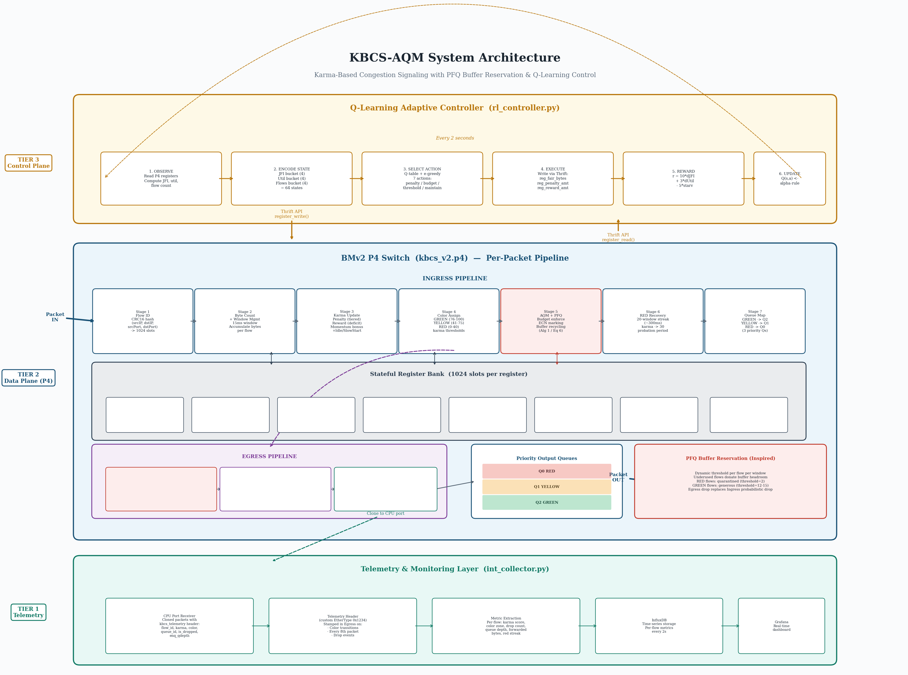

# KBCS — Karma-Based Congestion Signaling for Programmable Networks

> **TL;DR:** When multiple applications sharing the same internet link use different congestion control strategies, some hog bandwidth while others starve. KBCS is a P4-based network mechanism that assigns each flow a behavioural "karma" score, dynamically restricts greedy flows, and fairly distributes bandwidth — all at line rate inside the switch hardware itself.

---

## The Problem: Why Does This Need to Exist?

Imagine five people sharing a single internet pipe — one is streaming 4K video (BBR), one is downloading a file (CUBIC), one is on a video call (Vegas), and two others are browsing (Illinois, Reno). Each of these applications uses a **different congestion control algorithm (CCA)** — a built-in strategy for deciding how fast to send data and how to react when the network gets busy.

The trouble is: **these strategies are not equally aggressive**.

- **CUBIC and BBR** push hard and grab as much bandwidth as they can.
- **Vegas** politely backs off the moment it senses any delay.
- **Illinois** sits somewhere in the middle.

The result? In any shared network today, CUBIC and BBR dominate. Vegas-based flows receive as little as **8% of their fair share**. The person on the video call freezes while the 4K stream hogs the link. This is not a bug — it is how these algorithms are designed. The network has no mechanism to stop it.

**Quantified unfairness (Jain's Fairness Index, JFI, where 1.0 = perfectly fair):**
| Mix | JFI (Today, No Management) |
|---|---|
| CUBIC vs. Vegas | 0.69 |
| CUBIC vs. BBR | 0.50 |
| Same CCA (e.g., all CUBIC) | ~0.97 |

A JFI of 0.50 means one flow is effectively stealing the other's entire allocation. This is the baseline state of most real networks today.

---

## Why Can't Existing Solutions Fix It?

Several approaches have been tried. None solve the full problem:

| Approach | What it does | Why it falls short |
|---|---|---|
| **RED / CoDel / PIE** | Drop packets randomly from all flows | Doesn't distinguish between flows — Vegas gets penalised more than CUBIC |
| **Fair Queueing** | Give each flow its own queue | Hardware switches support max 8 queues; 100+ flows need queues |
| **P4air (2020)** | Tracks per-flow bytes in a P4 switch | No recovery — a greedy flow that calms down is still throttled forever |
| **CCQM (2026)** | Classifies CCAs into separate queues | Static thresholds — doesn't adapt when flow count or traffic pattern changes |
| **PFQ (2026)** | Proactively reserves buffer space per flow | No reputation — treats a chronic abuser the same as a new, well-behaved flow. KBCS **integrates PFQ's buffer recycling** but ties it to karma: buffer allocation is scaled by flow color |

The critical insight: **while modern AQMs like PFQ successfully introduce proactive buffer management to improve fairness, they still evaluate flows based on instantaneous metrics.** They judge a flow purely on what it is doing right now (no memory). KBCS bridges this gap by combining proactive buffer allocation with **behavioural history**, introducing a persistent reputation score (karma) to manage long-term fairness.

---

## What KBCS Does Differently

KBCS introduces **karma** — a numerical reputation score that each flow earns or loses based on how consistently it behaves fairly over time.

### The Core Idea

Think of it like a credit score for network flows:
- A flow that consistently sends within its fair share **earns karma** and is treated generously (high-priority queue, low drop rate, ECN marking before any drops).
- A flow that habitually grabs more than its fair share **loses karma** and is progressively throttled (lowest-priority queue, up to 90% of its excess packets dropped).
- A flow that has been throttled for long enough (and presumably has backed off) **gets a second chance** — its karma is partially restored so it can prove it has reformed.

This is a novel AQM mechanism that introduces **long-term behavioural memory** into a programmable data-plane switch.

### The Five Innovations

| Innovation | What it means |
|---|---|
| **Karma tracking in P4** | Every flow carries a reputation score updated on every packet, at line rate, inside the switch — no external state required |
| **Differentiated enforcement** | GREEN / YELLOW / RED zones with graduated drop rates (10% / 35% / 90%) and priority queues |
| **PFQ buffer reservation** | Per-flow dynamic queue thresholds: idle flows donate unused buffer to active flows; RED flows are quarantined to just 2 packets of buffer space |
| **Explicit recovery mechanism** | After 20 consecutive RED windows (~300ms), a penalised flow is partially rehabilitated — preventing permanent starvation |
| **Adaptive control plane** | A Q-Learning controller reads telemetry from the switch every 2 seconds and dynamically adjusts fairness thresholds as the number of flows changes |

---

## Results

Evaluated over **30 independent runs** per topology, comparing against FIFO (no management) and P4CCI (a state-of-the-art static-queue baseline):

| Metric | FIFO | P4CCI (Baseline) | **KBCS (Ours)** |
|---|---|---|---|
| **JFI — Dumbbell (4 flows)** | 0.719 | 0.879 | **0.954** (+8.5% vs P4CCI) |
| **JFI — Cross (8 flows)** | 0.811 | 0.851 | **0.913** (+7.2% vs P4CCI) |
| **Link Utilization — Dumbbell** | 45.5% | 97.2% | **98.1%** |
| **Packet Drop Ratio** | 0% | 0% | 0% |

KBCS achieves **statistically significant fairness improvements** in both topologies while maintaining near-full link utilisation — the typical trade-off between fairness and throughput does not apply here because KBCS enforces fairness without wasting capacity.

---

## How It Works — System Architecture



KBCS operates as a three-tier system:

1. **Control Plane** — A Q-Learning controller (`rl_controller.py`) reads aggregate telemetry from the P4 switch registers every 2 seconds, computes Jain's Fairness Index and link utilisation, then selects one of 7 actions (adjust penalty, budget, or thresholds) from a 64-state × 7-action Q-table. Updated parameters are written back to P4 registers via the Thrift API.

2. **Data Plane** — The P4 switch (`kbcs_v2.p4`) processes every packet at line rate through an 8-stage pipeline: Flow ID → Byte Counting → Karma Update (with proportional tiered penalties, momentum, idle recovery, and slow-start immunity) → Color Assignment (GREEN/YELLOW/RED) → AQM Enforcement + PFQ Buffer Reservation → RED Streak Recovery → Priority Queue Mapping → Telemetry Clone. The Egress pipeline performs PFQ-inspired proactive drops using per-flow dynamic queue thresholds.

3. **Telemetry** — Cloned packets carry a custom telemetry header (EtherType `0x1234`) to the CPU port, where `int_collector.py` extracts per-flow metrics and writes them to InfluxDB for real-time Grafana visualisation.

Every packet that arrives at the switch goes through this pipeline autonomously. The controller never touches individual packets — it only adjusts the global parameters (fair share threshold, penalty magnitude) that the data plane uses.

---

## Repository Structure

```
research_kbcs_v02/
│
├── kbcs_v2/                        ← KBCS implementation
│   ├── p4src/
│   │   └── kbcs_v2.p4              ← The P4 data-plane program
│   ├── kbcs-topo/
│   │   ├── topology.json           ← Cross topology (4 switches, 8 hosts)
│   │   └── dbell_topology.json     ← Dumbbell topology (2 switches, 8 hosts)
│   ├── topology/
│   │   └── topology.py             ← Mininet topology script
│   ├── controller/
│   │   └── rl_controller.py        ← Q-Learning adaptive controller
│   ├── results/                    ← All 6 experimental CSVs (30 runs each)
│   ├── plots/                      ← All publication plots (PNG)
│   ├── collect_metrics.py          ← Per-run metric collection script
│   ├── test_suite.sh               ← Automated 30-run experiment suite
│   ├── run_experiment.sh           ← Single experiment launcher
│   ├── analyze_results.py          ← Statistical analysis + LaTeX table gen
│   └── generate_paper_plots.py     ← Publication-quality 3-way comparison plots
│
├── baseline_p4cci/                 ← P4CCI comparison baseline
│   ├── p4cci_baseline_v2/
│   │   ├── p4cci_switch.p4         ← P4CCI data-plane program
│   │   ├── topology.py             ← 4-flow dumbbell topology
│   │   ├── topology_cross.py       ← 8-flow cross topology
│   │   ├── controller.py           ← P4CCI FCN-based controller
│   │   ├── test_suite_p4cci.sh     ← 30-run baseline suite
│   │   └── results/                ← Baseline CSVs
│   └── sync_p4cci.py               ← Script to sync code to VM
│
├── METHODOLOGY.md                  ← In-depth technical methodology
├── WEEKLY_PROGRESS_REPORT.md       ← Development timeline and decisions
└── README.md                       ← This file
```

---

## Topologies Evaluated

### Dumbbell (4 Flows, Single Bottleneck)
```
  h1 (CUBIC)   ─┐                         ┌─ h5 (server)
  h2 (BBR)     ─┼── S1 ── ~3Mbps ── S2 ─┼─ h6 (server)
  h3 (Vegas)   ─┤  (250 pps)          ├─ h7 (server)
  h4 (Illinois)─┘                         └─ h8 (server)
```
Four senders (H1–H4) each running a different CCA compete on a single ~3 Mbps bottleneck link (enforced via `set_queue_rate 250`) between S1 and S2. Four receivers (H5–H8) run iperf servers.

### Cross (8 Flows, 12 Hosts, Multi-Path Bottleneck)
```
  h1–h4 ─── S1 ──┬── S3 ─── h9, h10
                 ╲╱
  h5–h8 ─── S2 ──┤── S4 ─── h11, h12
```
Eight senders (H1–H8) across two access switches compete over cross-linked bottlenecks to four receivers (H9–H12) on two aggregation switches. Each inter-switch link is independently rate-limited to ~3 Mbps (250 pps) with separate KBCS instances at every switch.

---

## Running the Experiments

> **Environment:** Ubuntu 18.04 VM, P4 BMv2 software switch, Python 3.6+

### Quick start — run the full 30-experiment suite:
```bash
# Inside the VM
cd ~/kbcs_v2
bash test_suite.sh          # Runs all 30 experiments, all topologies, all modes
python3 analyze_results.py  # Generates summary statistics and LaTeX tables
python3 generate_paper_plots.py  # Generates all publication plots
```

### Single experiment:
```bash
# Step 1: Compile the P4 program
p4c --target bmv2 --arch v1model -o build/ p4src/kbcs_v2.p4

# Step 2: Start the topology
sudo python3 topology/topology.py

# Step 3 (new terminal): Start the controller
python3 controller/rl_controller.py

# Step 4 (Mininet CLI): Start traffic
mininet> h1 iperf3 -c h5 -t 60 -C cubic &
mininet> h2 iperf3 -c h6 -t 60 -C bbr &
mininet> h3 iperf3 -c h7 -t 60 -C vegas &
mininet> h4 iperf3 -c h8 -t 60 -C illinois &
```

---

## Technology Stack

| Component | Technology |
|---|---|
| Data plane | P4₁₆ (v1model architecture) |
| Switch simulator | BMv2 `simple_switch` |
| Network emulator | Mininet 2.3 |
| Controller | Python 3 with Thrift API |
| Controller algorithm | Q-Learning (64 states × 7 actions) |
| Traffic generation | iperf3 |
| Metric collection | Python, CSV |
| Analysis | NumPy, SciPy |
| Visualisation | Matplotlib |

---

## Frequently Asked Questions

**Q: Is this tested on real hardware?**  
A: The current implementation runs on BMv2, a software switch used for P4 research and prototyping. The P4 program is written to the v1model architecture and is directly portable to Tofino-based hardware with minor adjustments to extern calls.

**Q: How does KBCS know what CCA a flow is using?**  
A: It doesn't need to. KBCS is CCA-agnostic. Karma evolves naturally based on behaviour: BBR flows oscillate between GREEN and YELLOW because they probe aggressively but back off; Vegas flows stay GREEN because they self-throttle; CUBIC flows drift toward YELLOW/RED during slow-start. The system is inherently CCA-sensitive without needing explicit classification.

**Q: Doesn't high drop rate for RED flows hurt all users equally?**  
A: No. Only packets that exceed that flow's individual budget are eligible for dropping. A RED flow's budget is 25% of its fair share — meaning it can still send a quarter of what it deserves, just not the full amount. Cooperative flows in the GREEN zone are unaffected.

**Q: What is P4CCI, and why is it the comparison baseline?**  
A: P4CCI is a 2022 research system that uses a Fully Connected Neural Network (FCN) to classify TCP congestion control algorithms in real time and separate them into dedicated queues. It represents the state of the art in CCA-aware traffic management. It is a strong baseline because it has the same goal as KBCS but uses a static, pre-trained model with fixed queue assignments — no reputation tracking, no recovery, no adaptive thresholds.


## Contact

**Author:** Gaurav Jaiswal  
**GitHub:** [@gauravjaiswal12](https://github.com/gauravjaiswal12)
